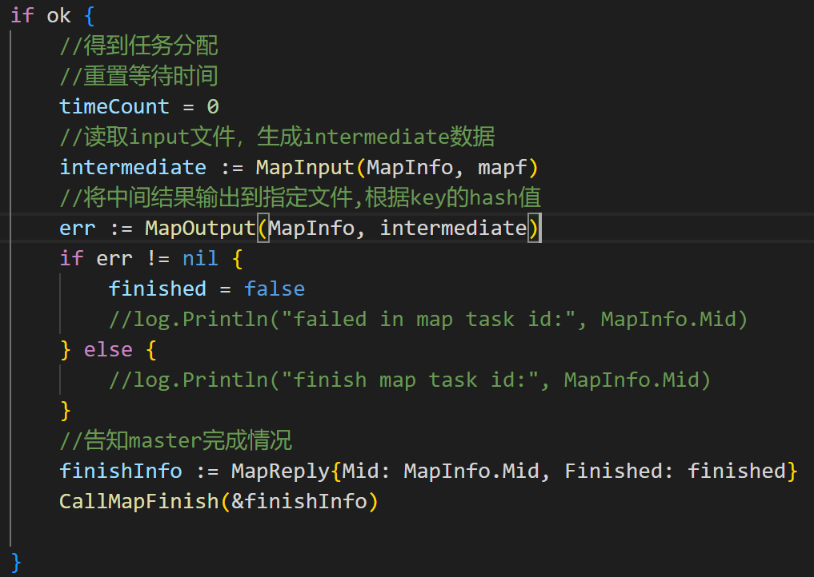

<h1> MapReduce </h1>

<h2>总结</h2>

<h3> 关于 MapReduce

Google的工程师在研究大规模数据处理时，发现了两个简单的操作模式：映射和归约。他们利用这两个操作模式，开发了MapReduce分布式计算框架，MapReduce将数据处理任务切分成多个小任务，自动分发到多个计算机上执行，从而大大提高了数据处理效率。

MapReduce是一种分布式计算模型，用于在大规模数据集上进行并行处理。它的设计目标是使大规模数据集的处理变得容易和高效。MapReduce包含两个主要阶段：Map阶段和Reduce阶段。Map阶段将输入数据拆分为多个小块，并且在每个小块上执行一个Map函数，将输入数据转换为一组键值对。Reduce阶段将Map输出中具有相同键的所有值聚合在一起，并生成一组输出值。MapReduce可以自动分配任务到多个计算机上进行执行，从而使数据处理变得更快速和高效。

​<h3>Concrete implements on Lab1</h3>

<h4> Master </h4>

设计Master的过程中，使用了map结构存储了任务，并同时使用了等待队列来管理任务的分配，
当任务分配出去时，需要计时等待worker的完成回应，当worker完成任务时则删除该任务，若是map任务，则一旦完成就生成新的reduce任务放入reduce任务等待队列中，当所有map任务完成时，master进入reduce阶段，才开始处理reduce相关分配，当所有reduce任务完成，则可以告知所有worker结束工作且自身退出

其中关键代码如下：

1. 分配map任务时，从map任务等待队列中取
   

2. 分配reduce任务时，从reduce任务等待队列中取
   

3. 完成map任务分配时，开始计时等待回应
   

4. 完成reduce任务分配时，开始计时等待回应

5. 等待函数使用select{}、time.After、channel来完成，当超时则将原本分配的任务重新放入等待队列，当收到完成回应则删除该任务，并进行接下来的处理

<h4> Worker </h4>

Worker实现相对简单，只需要不断地向Master请求任务分配，处理任务、告诉Master任务处理结果（Success or not）即可

其中关键代码如下：

1. 得到Map任务分配后，将完成MapInput和MapOutput两个过程，并得到完成的情况finished，将finished告知master
   

2. Reduce同理
   

​<h3>测试结果</h3>

<h3>一些踩坑的地方</h3>

  - rpc调度的args和reply不仅要求结构体首字母大写，还要求成员变量首字母大写，不然无法被rpc server或client访问到
  
  - 实现的过程中没有使用中间文件tempFile，导致测试时出现不合理覆盖问题，根据Lab1的Hint，应该是无论Map的中间文件还是Reduce的OutPut文件都需要先使用中间文件再强制覆盖
