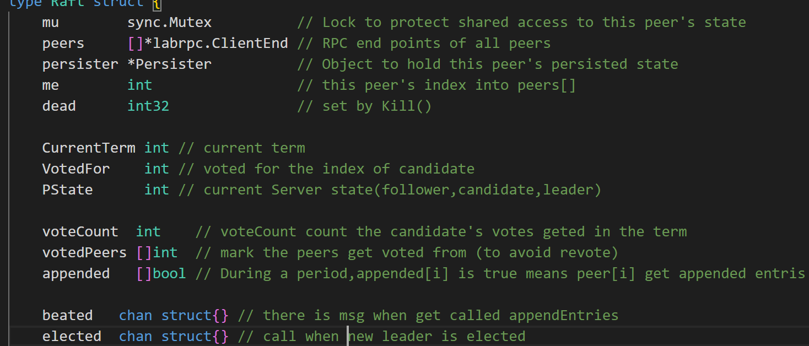
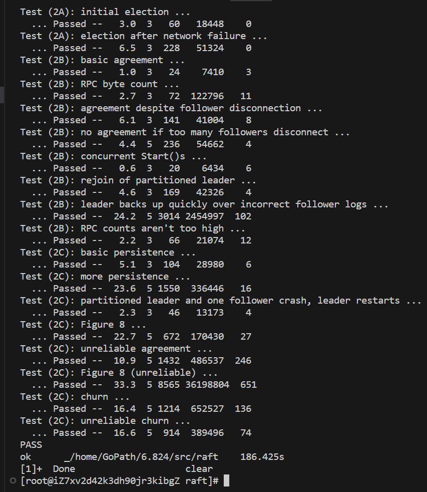

<h1> Raft </h1>

<h2> 关于 Raft <h2>


Raft是一种经典分布式一致性算法，用于在分布式系统中维护一致性。Raft将分布式一致性问题分解为以下几个部分：领导人选举、日志复制和安全性。Raft将系统的状态表示为一组日志条目，并通过一系列约束条件来维护一致性。

Raft算法中的每个节点都有一个角色，可以是follower、candidate或leader。在启动时，所有节点都是follower。当一个节点想要成为leader时，它需要先成为candidate并通过选举过程来获得其他节点的批准。一旦选举成功，此节点就成为leader，并负责领导日志条目的复制和提交。

其中日志复制是Raft的核心部分，它确保系统中的所有节点拥有相同的日志。领导人负责复制和提交新的条目，然后将它们发送给所有的跟随者，让它们也复制并提交新的条目。这确保了所有节点都拥有相同的日志历史。

安全性方面，Raft还通过特定的机制，例如心跳和超时机制，来避免出现多个领导人等问题，从而提高系统的稳定性和可靠性。Raft算法的设计简单、易于理解，不同于其他一些基于复杂协议的解决方案。


​<h2>杂谈</h2>

在Lab2中，要求实现Raft算法的分布式一致性协议。相比Lab1中简单的一对多通信，在Lab2中要求实现多对多(peer to peer)的分布式编程，这意味着遇到的冲突将更加频繁且复杂。同时，节点宕机等异常情况的处理也变得更加困难，因为需要保证状态的严格转变，否则会影响整个系统的稳定性。

所幸Raft论文提供了有效的指导，根据规则协议设计系统的实现，可以最大限度地避免问题的出现。但我本次根据指导实现的过程中，还是遇到了很多问题，出现了很多bug，当然大多数情况下是对论文还不够熟悉，存在误解，疏忽了部分细节地方所导致的，就比如TestFigure8Unreliable2C中因为rpc调度乱序、网络失常等问题，导致部分本应按时到达的rpc请求或回应被延迟到之后到达，此时就需要根据term值来判断是否回绝这类过期的request/reply，该问题经过我长时间调试并反复阅读论文才解决

总之，虽然Lab2的难度相对较高，非常具有挑战性的，但也让我深刻体会到了严谨的代码是满足强一致性的必要条件。

​<h2>Concrete implements on Lab2</h2>

<h3> Lab2A-Election </h3>

Lab2A实现基本的raft选举过程，涉及节点身份转变、大多数投票原则、以及心跳机制，特别的是，2A的代码由于2B日志的追加，将在投票前追加判断对方的日志是否最新，最新才投给对方。

整个选举思路是，每个节点初始是follower，follower节点每隔一段时间（随机化防止同时选举）后若没接收到leader心跳时，则开启选举，同时将任期+1，并向其他节点申请投票，每个节点受到candidate的投票请求时，首先判断对方的任期是否大于自己，其次判断对方日志是否比自己更up-to-date，最后判断自己是否还有票，当这三个判断通过时才将票投给对方，否则不投。当candidate收到大多数投票时，其将成为新的leader并立即发送心跳（即空的AppendEntries）给每个节点，阻止剩下的节点发起选举；若选举失败，则退回follower状态。

其选举流程如下：


其中关键代码如下：

1. Raft部分定义
   


2. 等待leader发送心跳
   
```go
for !rf.killed() {
		rf.mu.Lock()
		m := rf.PState == leader
		rf.mu.Unlock()
		// 自身为leader的时候不用等待
		if m {
			time.Sleep(baseElectionTimeOut)
			//log.Println(rf.me, "is leader")
			continue
		}
		// 随机等待心跳时间(140-300毫秒)
		randNum := r.Intn(151) + baseElectionTimeOut
		timeOut := time.Millisecond * time.Duration(randNum)
		//log.Println(timeOut)
		select {
		case <-time.After(timeOut):
			// 超时则发起选举
            ......
			log.Println("start election id:", rf.me)
			rf.CurrentTerm++
			rf.PState = candidate
			rf.VotedFor = rf.me
            ......

			//log.Println("called appendEntries id:", rf.me)
			if rf.sendRequestVoteAll() {
				//成功胜选
                ......
				// 立刻发送心跳告知其他人新的leader
				go rf.LeaderBroadCast()
			} else {
				// 没能成功当选
                ......

			}
		case <-rf.beated:
			// 心跳重置
			//log.Println("restart election timeOut id:", rf.me)
		}
	}
```

3. 发起选举并申请投票
   
```go
// 向每个raft发送投票请求 (除自己外)  返回选举是否成功
func (rf *Raft) sendRequestVoteAll() bool {
    // define channel winCh,loseCh,timeOut,length,requestNum
    ......
	for i := range rf.peers {
        ......
		go func(i int) {
            ......
			ok := rf.sendRequestVote(i, args, reply)
            ......
	        if reply.Term < rf.CurrentTerm {
			} else if reply.VoteGranted {
                // 收到投票
                rf.voteCount++
				rf.votedPeers[i] = 1
                ......
			} else if reply.Term > rf.CurrentTerm {
				// 当他人的term大于自己时，自己必须放弃选举,并更新自己的term到最新
				rf.CurrentTerm = reply.Term
                ......
				// 终止还未进行的投票请求
				if len(loseCh) < cap(loseCh) && !over {
					loseCh <- struct{}{}
				}
				over = true
			} else {
                ......
			}

			requestNum--
			if requestNum == 0 {
				// 当所有requestVote请求完毕时检查票数
				if rf.voteCount > length {
					// 当选
					if len(winCh) < cap(winCh) && !over {
						winCh <- struct{}{}
					}
					over = true
				} else {
					// 落选
					if len(loseCh) < cap(loseCh) && !over {
						loseCh <- struct{}{}
					}
					over = true
				}
			}

		}(i)

	}

	select {
	case <-time.After(timeOut):
        // 选举超时直接返回结果
        ......
		return rf.voteCount > length
	case <-winCh:
		// 胜选
        ......
		return true
	case <-loseCh:
		// 中途失败
		return false
	}
}
```

4. RequestVote实现
```go
func (rf *Raft) RequestVote(args *RequestVoteArgs, reply *RequestVoteReply) {
    .......
	if args.Term < rf.CurrentTerm {
		// candidate的任期小于自己
		*reply = RequestVoteReply{
			Term:        rf.CurrentTerm,
			VoteGranted: false,
		}
		// 过时的消息直接忽略
		return
	}
    ......
	// 检查对方的日志是否比自己更加up-to-date
	// 如果两个日志最后一个entry任期不同，任期更大的更加“up-to-date”
	// 如果两个日志最后一个entry任期相同，日志更长的更加“up-to-date”
	if args.LastLogTerm < rf.LogEntrys[logSize-1].Term ||
		(args.LastLogTerm == rf.LogEntrys[logSize-1].Term && args.LastLogIndex < logSize-1) {
		// 若对方日志比自己old，则返回false
    	......
		*reply = RequestVoteReply{
			Term:        rf.CurrentTerm,
			VoteGranted: false,
		}
		return
	}
	if args.Term > rf.CurrentTerm {
		rf.CurrentTerm = args.Term
		// 根据rule，对方term比自己大就要转变为follower
		rf.PState = follower
		if rf.VotedFor == -1 {
			// 自己还有选票
			*reply = RequestVoteReply{
				Term:        rf.CurrentTerm,
				VoteGranted: true,
			}
			rf.VotedFor = args.CandidateId
			// 开启投票计时
			go rf.VoteTimeKeeper()
		} else {
            ......
            // 没有选票
			*reply = RequestVoteReply{
				Term:        rf.CurrentTerm,
				VoteGranted: false,
			}
            ......
		}
	} else {
		*reply = RequestVoteReply{
			Term:        rf.CurrentTerm,
			VoteGranted: false,
		}
        ......
	}
}
```

5. leader需要持续地向follower发送心跳，哪怕没有新的日志需要同步
   
```go
// ContinueAppend只是保证在定期内一定能向每个raft server发送AppendEntries来阻止其发生选举
func (rf *Raft) ContinueAppend() {
	// 当conver to candidate or follower时，退出
	for !rf.killed() {
		time.Sleep(appendPeriod)

		rf.mu.Lock()
		m := rf.PState != leader
		rf.mu.Unlock()
		if m {
			// 不为leader的时候无资格发送
			continue
		}
        ......
		rf.mu.Lock()
		for i, ok := range rf.appended {
			if i == rf.me {
				continue
			}
            ......
			//log.Println(rf.me, rf.PState)
			if !ok {
				//log.Printf("%d try to send appendEntries to %d", rf.me, i)
				// 还未定期内发送过appendEntris rpc请求
				// 开辟协程来发送rpc请求
				go rf.TryApplyEntry(i)
			} else {
				// 已经发送过了
				rf.appended[i] = false //重置
			}
		}
		rf.mu.Unlock()
	}
}
```

<h3> Lab2B-Log Replication </h3>

Lab2B实现起来也比2A复杂得多，本次主要实现日志复制的功能，当client申请start a command时，leader会使用AppendEntries调度follower，来检查每个节点是否和leader一致且能够同步接下来的日志并执行command（常见的如网络原因而不能同步或执行，这里2B实现时并不需要真的执行），和选举过程的协议类似，都是大多数原则，仅当大多数节点返回Success为true时，leader才认为这个Entry能够提交。

特别注意的是，根据raft论文中Figure 8中的例子，leader还需要再进一步判断该Entry是否处在当前任期（若不处在当前任期，这个Entry有被其他节点覆盖的风险，不能鲁莽地提交），当然这里的不提交不代表该日志不可能再提交了，当确认大多数节点的log更新到该日志Entry的index后面时且其term符合当前日期，就可以将之前过期还未提交的日志一并提交（因为leader已经确认大多数节点同步了自己的日志，包括先前“危险”的Entries）

当日志被提交时，leader会优先存储到state machine中再真正提交，同时更新commitIndex，并在下一次心跳时自动告知其他follower节点更新commitIndex,和leader同步提交

其中关键代码如下：

1. 额外在Raft结构体中添加信息
   
```go
	commited chan struct{} // call when commitIndex changed
	//*** Log variable
	logMu       sync.Mutex
	commitIndex int     // index of highest log entry known to becommitted (initialized to 0, increases monotonically)
	lastApplied int     // index of highest log entry applied to state machine (initialized to 0, increases monotonically)
	nextIndex   []int   // all the servers's next index to append log entry (reinitialized after election)
	matchIndex  []int   // all the server's last index that match leader's log entry (reinitialized after election)
	LogEntrys   []Entry // the raft server's log entries in memory

	applyChan chan ApplyMsg
```

2. 对于leader,我特定封装了TryApplyEntry方法来统一调度，该方法将只根据每个节点的nextIndex，参数中附带nextIndex后的leader日志，并根据follower返回的消息，更新每个节点的nextIndex，matchIndex，如成功时，nextIndex和matchIndex则跟进新添加的entries数量，失败时，leader则尝试减少nextIndex来找到最后面匹配follower日志的index，从而将该follower的日志同步leader
   
```go
// 尝试提交新的entry到follower(基于nextIndex)
func (rf *Raft) TryApplyEntry(i int, entries ...Entry) {
    ......
	nextIdx := rf.nextIndex[i]
	var nextEtys []Entry
	if nextIdx-1 < len(rf.LogEntrys)-1 {
		nextEtys = append(rf.LogEntrys[nextIdx:], entries...)
	} else {
		nextEtys = entries
	}
	//log.Println(rf.me, "'s nextIndex", i, "will from", nextIdx, "to", nextIdx-1+len(nextEtys))
	args := MakeAppendEntriesArgs(rf.CurrentTerm, rf.me, rf.LogEntrys[nextIdx-1].Term, nextIdx-1, rf.commitIndex, nextEtys)
	reply := &AppendEntrisReply{}
    ......
	ok := rf.sendAppendEntries(i, args, reply)
    ......
	if ok {
		rf.mu.Lock()
		m := reply.Term > rf.CurrentTerm
		rf.mu.Unlock()
		if args.Term < rf.CurrentTerm {
			// 过时的返回则无视
            ......
		} else if m {
			// 若存在raft server比自己term还高，则退回follower
            ......
		} else if reply.Success {
			// 若reply中success为true即该follower能够提交该日志
            ......
			rf.matchIndex[i] = args.PrevLogIndex + len(args.Entrys)
			rf.nextIndex[i] = rf.matchIndex[i] + 1
            ......
		} else {
			// 存在对方日志和leader冲突（或者丢失）的情况，必须进行日志诊断
			lastTerm := reply.LastLogTerm
			//rf.mu.Lock()
			rf.logMu.Lock()
			nIndex := rf.nextIndex[i] - 1
			log.Println(rf.me, "log conflict in", i)
			// 将nextIndex[i]递减，直到找到entry的term小于等于follower的term
			for nIndex > 0 && rf.LogEntrys[nIndex].Term > lastTerm {
				nIndex--
			}
			//rf.mu.Unlock()
			rf.logMu.Unlock()
			// 从这里开始频繁递减并调用appendEntries，来回退到最后能匹配的index
			for nIndex > 0 {
                ......
				args := MakeAppendEntriesArgs(rf.CurrentTerm, rf.me, rf.LogEntrys[nIndex].Term, nIndex, rf.commitIndex,append(rf.LogEntrys[nIndex+1:], entries...))
                ......
				reply := &AppendEntrisReply{}
				ok := rf.sendAppendEntries(i, args, reply)
				// 若发送AppendEntries后，leader节点发生转变
				if rf.PState != leader || rf.CurrentTerm != args.Term {
					return
				}
				if ok {
					if args.Term < rf.CurrentTerm {
						// 过时的返回则无视
                        ......
					} else if reply.Success {
						// 成功找到并令follower同步了leader日志
                        ......
						rf.matchIndex[i] = args.PrevLogIndex + len(args.Entrys)
						rf.nextIndex[i] = rf.matchIndex[i] + 1
                        ......
						break
					} else {
						// 日志回退
						nIndex--
					}
				} else {
					// 网路等异常情况，放弃rpc调度
                    ......
					break
				}
			}
            ......
		}
	}
}
```

3. leader持续性检查更新commitIndex（根据matchIndex）
   
```go
// leader每个一段时间检查是否需要更新log信息并commit到stable machine
func (rf *Raft) CheckUpdate() {
	for !rf.killed() {
        ......
		if rf.PState == leader {
			matchCount := 1
			minMatch := 1<<31 - 1 // minMatch记录matchIndex大于commitIndex中的最小值
			rf.logMu.Lock()
			for i, mIndex := range rf.matchIndex {
                ......
				if mIndex > rf.commitIndex {
					//log.Println(mIndex, rf.commitIndex)
					if mIndex > 0 && rf.LogEntrys[mIndex].Term == rf.CurrentTerm {
						matchCount++
					}
					if minMatch > mIndex {
						minMatch = mIndex
					}
				}
			}
			if matchCount > len(rf.peers)/2 && minMatch != 1<<31-1 {
				// 当大多数follower的matchIndex超过了leader的commitIndex时
				// 提交前先查看该index的term符不符合当前任期，不符合则等到后面的entry符合时才提交
				// 因为根据Log Matching Property 原则
				// 之前index的数据也会被一并提交
				if rf.LogEntrys[minMatch].Term == rf.CurrentTerm {
					rf.commitIndex = minMatch
					// 更新状态
					rf.persist()
					rf.commited <- struct{}{}
				}

			}
			rf.logMu.Unlock()

		}
        ......
		time.Sleep(updatePeriod)
	}

}
```

4. 节点会被leader调度AppendEntris（算作心跳），需先拒绝无效请求（是否过期，leader是否已out），接着根据ledaer发过来的参数中prevIndex和prevLogTerm进行对比，判断自己是否存在日志的缺失、矛盾两个情况，若出现则告知leader自己未能同步日志，反之则跟进同步leader的日志并跟进leader的commitIndex
   
```go
func (rf *Raft) AppendEntris(args *AppendEntrisArgs, reply *AppendEntrisReply) {
	// 收到leader调度的appendEntryis rpc请求，同时作为心跳机制，重置选举计算器
	rf.mu.Lock()
	defer rf.mu.Unlock()
	if args.Term < rf.CurrentTerm {
        // 过期rpc请求
		*reply = AppendEntrisReply{
			Term:    rf.CurrentTerm,
			Success: false,
		}
		log.Println(rf.me, ":the leader's term is out-dated from", args.LeaderId)
		return
	}
    ......
	if args.Term < rf.CurrentTerm {
		// 当这个"leader"的term小于自己时说明其有可能不再有资格作为leader
		// 除检查term外，还须将自己的log和对方leader的log进行对比，若自己的更加up-to-date，则认为是无效请求
		if args.PrevLogIndex < logSize-1 ||
			(args.PrevLogIndex == logSize-1 && args.PrevLogTerm < rf.LogEntrys[logSize-1].Term) {
			// 自己的日志更加up-to-date
			if rf.CurrentTerm < args.Term {
				rf.CurrentTerm = args.Term
				rf.persist()
			}
			*reply = AppendEntrisReply{
				Term:        rf.CurrentTerm,
				Success:     false,
				LastLogTerm: rf.LogEntrys[logSize-1].Term,
			}
			// 无效请求
			log.Printf("***useless appendEntries id %d from %d", rf.me, args.LeaderId)
			return
		}
	}
	if args.Term > rf.CurrentTerm {
        // 根据rule，把自己的任期更新
		rf.CurrentTerm = args.Term
	}
	// 对方leader的日志更加up-to-date
	if len(rf.beated) < cap(rf.beated) {
		rf.beated <- struct{}{} //重置选举超时时间
	}
	// 先检查follower是否包含preIndex中的entry
	if logSize-1 < args.PrevLogIndex {
		// log在preIndex上缺少entry
		*reply = AppendEntrisReply{
			Term:        rf.CurrentTerm,
			Success:     false,
			LastLogTerm: rf.LogEntrys[logSize-1].Term,
		}
	} else if ent := rf.LogEntrys[args.PrevLogIndex]; ent.Term != args.PrevLogTerm {
		// 再检查该entry的term值是否匹配leader的entry
		// 产生冲突，删除后续的所有entry
		*reply = AppendEntrisReply{
			Term:        rf.CurrentTerm,
			Success:     false,
			LastLogTerm: rf.LogEntrys[logSize-1].Term,
		}
		// 不一致则从prevLogIndex开始全部删去后面的
		rf.LogEntrys = rf.LogEntrys[:args.PrevLogIndex]
        .......
	} else if args.LeaderCommit > rf.commitIndex {
		// 未产生日志冲突，需要查看leader有没有发送额外的entrys
        ......
		rf.commitIndex = Min(logSize, args.LeaderCommit)
		*reply = AppendEntrisReply{
			Term:        rf.CurrentTerm,
			Success:     true,
			LastLogTerm: rf.LogEntrys[logSize-1].Term,
		}
		if len(args.Entrys) > 0 {
			rf.LogEntrys = append(rf.LogEntrys[:args.PrevLogIndex+1], args.Entrys...)
			// state changed,so pesist it
			rf.persist()
		} else {
			rf.LogEntrys = rf.LogEntrys[:args.PrevLogIndex+1]
			rf.persist()
		}
		rf.commited <- struct{}{} // 提醒commitIndex已更新
	} else {
		// 未产生日志冲突，需要查看leader有没有发送额外的entrys
		*reply = AppendEntrisReply{
			Term:        rf.CurrentTerm,
			Success:     true,
			LastLogTerm: rf.LogEntrys[logSize-1].Term,
		}
		if len(args.Entrys) > 0 {
			rf.LogEntrys = append(rf.LogEntrys[:args.PrevLogIndex+1], args.Entrys...)
            .......
		}
	}
    .......
}
```

5. 节点的不同协程直接通过channel rf.commited通信告知commitIndex更新，当提醒commitIndex更新时，raft节点需立刻跟进rf.lastApplied，将其提交到状态机中
   
```go
// 等待commitIndex更新
func (rf *Raft) WaitCommit() {
	for range rf.commited {
		if rf.killed() {
			break
		}
		//log.Println("commited get called")
		rf.mu.Lock()
		rf.logMu.Lock()
		// 无论leader还是follower，当commitIndex超出lastApplied时，则需要提交到状态机中
		for rf.lastApplied < rf.commitIndex {
			rf.lastApplied++
			msg := ApplyMsg{
				CommandValid: true,
				Command:      rf.LogEntrys[rf.lastApplied].Conmmand,
				CommandIndex: rf.lastApplied,
			}
			log.Printf("%d applied msg %v to state machine,term:%d\n", rf.me, msg, rf.LogEntrys[rf.lastApplied].Term)
			rf.applyChan <- msg
		}
		rf.logMu.Unlock()
		rf.mu.Unlock()
	}
}
```

<h3> Lab2C-Persistence </h3>

Lab2C中实现raft状态的持久化，raft论文中需要持久化的包括currentTerm，votedFor，log(我的是LogEntrys)，但我为了让raft节点重启时不用再次提交重复的entry，于是额外持久化了commitIndex和lastApplied两个变量，从而减少性能开销。

哪里需要持久化？只需要在每次raft状态改变时进行持久化即可，需要注意的是，在apply一个entry到state machine之前，要先进行持久化，不能颠倒顺序，类比于提交数据库事务时先提交日志再提交事务

其中关键代码如下：

1. Persist
   
```go
func (rf *Raft) persist() {
	// Your code here (2C).
	// Example:
	w := new(bytes.Buffer)
	e := labgob.NewEncoder(w)
	e.Encode(rf.CurrentTerm)
	e.Encode(rf.VotedFor)
	e.Encode(rf.LogEntrys)
	data := w.Bytes()
	rf.persister.SaveRaftState(data)
	//log.Println(rf.me, "persisted state")
}
```

2. ReadPersist
   
```go
func (rf *Raft) readPersist(data []byte) {
	if data == nil || len(data) < 1 { // bootstrap without any state?
		log.Println(rf.me, "without any state")
		return
	}
	// Your code here (2C).
	// Example:
	r := bytes.NewBuffer(data)
	d := labgob.NewDecoder(r)
	var (
		CurrentTerm int
		VotedFor    int
		LogEntrys   []Entry
		commitIndex int
		lastApplied int
	)
	if d.Decode(&CurrentTerm) != nil ||
		d.Decode(&VotedFor) != nil ||
		d.Decode(&LogEntrys) != nil {
		log.Println("failed to read Pesist")
	} else {
		// 赋值
		......
	}
	if rf.VotedFor != -1 && rf.VotedFor != rf.me {
		// 若之前已经投了票，则重新计时，超时则收回投票
		// 开启投票计时
		go rf.VoteTimeKeeper()
	} else if rf.VotedFor == rf.me {
		// 宕机前处于candidate状态，应该重置回follower，投票也需重置
		rf.VotedFor = -1
	}
}
```

​<h2>测试结果</h2>



<h3>Day 6.15</h3>
其中TestBackup2B测试了数十次从未出错，TestFigure82C同样测试了近万次迭代未出错，而在TestFigure8Unreliable2C中当迭代大概3000次测试时会出现一次错误，错误的原因在于长时间未能选出leader（由于大量的rpc延迟调度等问题，这里当我将选举超时时间延长到400-600毫秒时出现的概率更低一些），TestFigure8Unreliable2C迭代测试了近万次从未出现过一致性问题

<h3>Day 8.16</h3>
在完成lab4的过程中,因为raft出了问题,所以又回顾寻找出了bug,实际上是因为rf.VotedFor有一段代码并未使用Lock保护起来,导致出现了并发问题,从而长时间选不出合适的leader或者leader多次选举又变回follower

<h2>印象深刻的地方</h2>

  - 前几次测试TestBackup2B时都出现了错误，根据所给的注释可以看出，该测试旨在模拟disconnect大多数集群节点导致崩溃，又突然connect回来导致集群恢复，考察复杂网络情况下raft能不能保证数据同步的速度及稳定性，而我遇到的主要问题在于选举，本次测试逼迫着我多次回头看了raft论文，从而得知自己忘了在requestVote中对日志进行判断，导致apply error以及长时间未能同步日志

  - 同样在TestBackup2B中，我还遇到了测试超时的问题，当即就知道自己代码优化不到位，于是需要进行一系列优化，完成以下两种优化后，在TestBackup2B中大概能从45s降到25s
    - 优化一：leader和follower冲突时的日志回退操作进行优化，具体思路是follower返回最后一个日志的term，leader根据这个term向前一直回退直到找到符合该term的entry（根据日志任期的非递减特性可以排除掉任期高的entry），从而减少了rpc调度测试，提高了raft的数据同步速度
    - 优化二：之前对于每个节点，我专门开辟了一个协程隔一段时间检查commitIndex更新情况，但这样效率偏低，既没做到即时性，又会在未更新时带来不必要的性能开销，于是专门使用了channel来协程间通信，当commitIndex更新时则发消息到该channel，另一个协程则持续阻塞等待该channel的输出
  
  - 在将自己的票投给candidate时，论文中并没有明确讲是否应该重置选举超时时间来防止自己该任期内发起选举，论文中只规定了节点只有受到来自leader的心跳时才能重置时间并重置选票，于是一开始我按照这样的方式后，直到测试时出现刚上任leader宕机，**问题就来了：<br><br>假设有三个节点a、b、c，其中a节点选举得到了b、c两者的投票，即将成为leader的瞬间宕机，于是b、c两节点迟迟不能得到leader的心跳，无法重置选票，在我的设计中，当自己投了票（votedFor!=-1）则不能开启选举，于是整个raft集群就“死锁”了**。<br><br>可能会想为什么非得有票才能开启选举，若是不这样限制，当节点刚投给candidate一票时，可能立刻开启新一轮选举，导致同时存在多个candidate在选举，很容易出现长时间选不出leader的情况<br><br>
  而我此时想的办法是**投票也需要一个计时**，当接近一个选举超时时间未能得到leader的心跳时则收回该投票，从而避免了这种“死锁”的发生，这也让我意思到了，网络编程的时候，不允许只有接收到其他节点消息才能进入下一阶段或下一状态的情况，这样可能由于网络等意外情况导致本地节点始终困在该阶段，针对这种情况应当采用超时机制，当超时则退回之前的阶段或状态

  - 完成2B时并没有注意Figure8的情况就通过了，导致2C中测试TestFigure2C时出现了日志不一致的错误，本质原因在于leader即使得知大多数节点已经同步了index=N的entry，当该entry的term和当前任期不同时，应当被视为“危险”的entry，原因如同Figure8描述的，未提交的entry不同于当前任期时当作过期处理，而过期的日志很有可能在其他节点中已经被新的日志覆盖了而自己并不得知（提交前宕机，启动后又重新成为leader）。正确的做法是：leader只能提交到符合当前任期的日志，当遇到过期的日志时，不会立即提交，而是等到新的日志append后且确认大多数节点都同步时才能一并提交

  - 2C中最难的测试莫过于TestFigure8Unreliable2C,其既考察Figure8中的情况，又考察rpc调度延迟等不可靠网络情况下的raft performance，针对延迟调度的问题，需要对于rpc调度的args和reply的term进行检查，当其term值小于自己的term则视为过期请求/返回，可以直接跳过不处理，该测试之所以难，还是因为2B实现时还遗留了很多缺陷没测试出来，导致后面反复查看log检查出错原因


​<h2>总结</h2>
作为一个刚接触分布式项目的新手，刚开始写raft时有些措不及防，不知从何下手，但通过阅读论文，听了MIT老师讲诉raft相关知识后，也逐渐有了思路进行下去。整个Lab2中基本是跟着论文的指导进行的，包括对于RPC结构体的定义，raft参数的含义解释，以及rpc调度的规则、各个role的规定等。

由于我本身拥有较好的并发编程基础，在Lab2A中并没有受到太大阻碍，而当实现Lab2B时，由于牵扯到一致性的问题，很多细节的缺少就暴露了出来，2A中的部分代码都要重做。由于新增了日志所需变量进行维护，我特定添加了logMu日志锁，加上原来的mu锁，同时使用两把锁的不熟练也使我不得不遇到了死锁问题（当然可以只有1把锁，但我希望能减少锁的粒度，提高一点性能）。

论文终究是论文，具体实现时肯定是有很多细节未在论文中提及的，而我在实践过程中，不断遇到问题并解决问题（2B中推翻2A部分代码，2C中推翻2B中部分代码）。长时间的调试并从茫茫日志中找到关键信息的确考验一个人的耐心，也是让我深刻体会到分布式系统的严谨，良好的fault tolerance必然是需要健壮的代码逻辑的支持。非常感慨能完成这样有挑战性的Lab，这让我收获很多。
