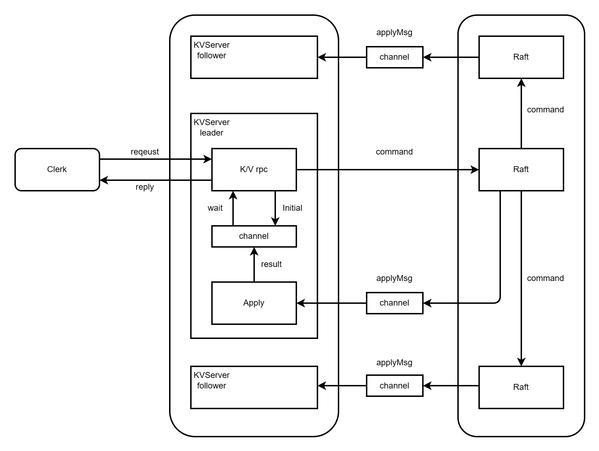
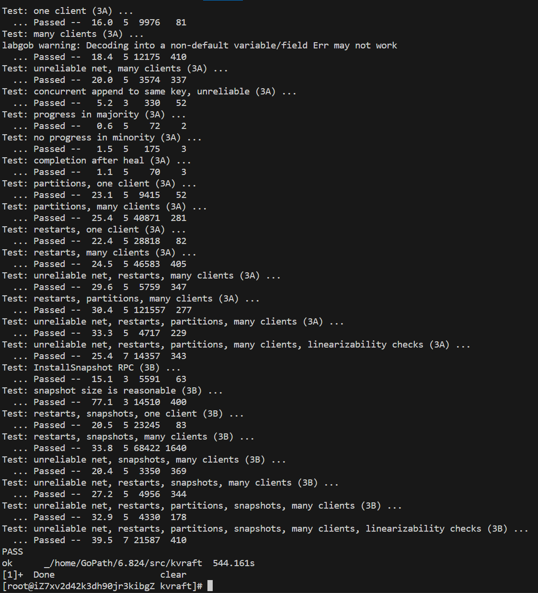

<h1> KVRaft </h1>

<h2>概述</h2>

在本次lab3中,按照指导,我们在lab2中实现的raft的基础上实现个简单K/V数据库.本次lab中并无论文指导,关键要点在于实现Get和PutAppend接口,且能利用raft达成kv Operation的共识,在集群中保证大多数kv数据库都同步更新后的数据.

同时还需要实现SnapShot来防止raft日志的无限增长,并通过SnapShot保留那一刻kv数据库的关键数据,该操作raft来达成共识,因此还需进一步修改raft.

<h2>概念图</h2>



<h2>Lab3A</h2>

<h3>Clerk</h3>

在本次实验中,将由我们自定义一个Clerk完成对KVServer的RPC请求,包括调用其Get/Put/Append接口

根据指导,当Clerk request失败后(因为超时或者对方不是leader),其不应该放弃requst,而是更换server,重新进行一次request直到最后收到成功的回应.

特别需要注意的是,如若不将每次request标注一个序号,很容易令kvserver执行重复的命令导致出错,因此还需在Clerk维护一个请求序列

Clerk关键代码如下:

1. Clerk定义:
```go
type Clerk struct {
	servers []*labrpc.ClientEnd
	// You will have to modify this struct.
	mu       sync.Mutex
	target   int64 // the target kvserver to send rpc request(may not be the leader)
	clientId int64 // the client's id
	serialId int64 // the command sequential id
}
```

2. Get请求:
```go
func (ck *Clerk) Get(key string) string {
	// You will have to modify this function.
	DPrintf("Get key: %s", key)
	ck.mu.Lock()
	args := GetArgs{Key: key, ClientID: ck.clientId, SerialID: ck.serialId}
	reply := GetReply{}
	ck.mu.Unlock()
	ok := ck.servers[ck.target].Call("KVServer.Get", &args, &reply)

	// 请求失败时不断重复请求
	for !(ok && (reply.Err == OK || reply.Err == ErrNoKey)) {
		ck.target = (ck.target + 1) % int64(len(ck.servers))

		//DPrintf("client id:%d serialid:%d Get receive err:%s from server %d\n", ck.clientId, ck.serialId, reply.Err, oldtarget)
		ok = ck.servers[ck.target].Call("KVServer.Get", &args, &reply)
	}
	//ck.serialId++
	DPrintf("client id:%d serialid:%d successfully get %s\n", ck.clientId, args.SerialID, reply.Value)
	return reply.Value
}
```

3. PutAppend请求:
```go
func (ck *Clerk) PutAppend(key string, value string, op string) {
	DPrintf("putAppend key: %s val %s\n", key, value)
	// You will have to modify this function.
	ck.mu.Lock()
	args := PutAppendArgs{Key: key, Value: value, Op: op, ClientID: ck.clientId, SerialID: ck.serialId}
	reply := PutAppendReply{}
	ck.mu.Unlock()

	ok := ck.servers[ck.target].Call("KVServer.PutAppend", &args, &reply)

	// 请求失败时不断重复请求(如果server回应command重复则说明该Op已经在分布式系统执行完成了)
	for !(ok && (reply.Err == OK || reply.Err == ErrNoKey || reply.Err == ErrCommandRepeated)) {
		ck.target = (ck.target + 1) % int64(len(ck.servers))
		//DPrintf("client id:%d serialid:%d Get receive err:%s from server %d\n", ck.clientId, ck.serialId, reply.Err, oldtarget)
		// 需要注意的是，putAppend当中，每次发出新的请求都需初始化reply
		reply = PutAppendReply{}
		ok = ck.servers[ck.target].Call("KVServer.PutAppend", &args, &reply)
	}
	// 完成请求后序列号+1
	ck.serialId++
	DPrintf("client id:%d serialid:%d successfully putAppend\n", ck.clientId, args.SerialID)
}
```

<h3>KVServer</h3>

KVServer需要完成Get/PutAppend接口,同时由于需要利用raft达成共识,需要使用raft层提供的Start(command)接口来开启共识,并利用applyMsg来应用达成共识command,也因此需要开启一个协程持续wait该channel,等待执行命令

此外,为了避免执行了重复的Op,需要每个KVServer维护一个record来记录每个client当前处理到的请求序列

比较关键的地方在于,当KVServer收到request并开启raft来达成command后,当执行完command之后需要将结果反馈给当时的请求以作回应,而这涉及两个协程之间的通信,因此我们可以很自然地想到使用channel.

而最关键要思考的点来了,如何才能反馈给当时的channel呢,很显然不能提前自定义一个channel,然后所有msg都通过这个channel来反馈,因为不能识别这个channel对应哪个request,所以我们在接收request时make一个channel并为其进行标识,如此就可以想到维护一个**map[int]channel OpResult**的结构体,key值对应每个command所在raft中的index,value值是一个无缓冲OpResult的管道,接收command执行后的结果.

KVServer关键代码如下:

1. KVServer及Op定义:
```go
type Op struct {
	// Your definitions here.
	// Field names must start with capital letters,
	// otherwise RPC will break.
	Operaiton string
	Key       string
	Value     string

	// unique sign to identify each operation
	ClientId int64
	SerialId int64
}

type OpResult struct {
	// Operation的执行结果，包含执行内容，执行的key，put/append执行的value或get返回的value
	Operaiton string
	Key       string
	Value     string

	ClientId int64
	SerialId int64
}

type KVServer struct {
	mu      sync.Mutex
	me      int
	rf      *raft.Raft
	applyCh chan raft.ApplyMsg
	dead    int32 // set by Kill()

	maxraftstate int // snapshot if log grows this big

	// Your definitions here.
	db              map[string]string     // the k/v memory storege database
	clientsOpRecord map[int64]int64       // record each client's max Op sequential number
	waitResultsCh   map[int]chan OpResult // the waiting Op end channel that matches the logIndex

	LastIncludedIndex int // the raft logs' lastIncludeInded that used to discard old logs
	maxCommandIndex   int // it record the maximum num of CommandIndex
}
```

2. 等待applyMsg的协程:
```go
func (kv *KVServer) waitApply() {
	// ready为true时，标志着当commitIndex=nextLastIncludedIndex时，需要执行snapshot
    ......
	for msg := range kv.applyCh {
		DPrintf("kvserver %d start apply index %d\n", kv.me, msg.CommandIndex)
		// 等待raft节点允许执行apply操作
		if msg.CommandValid && !kv.killed() {
			    kv.mu.Lock()
				// Get/Put/Append命令
				op := msg.Command.(Op)
				// 跳过重复执行的操作(Get除外)
				if op.SerialId <= kv.clientsOpRecord[op.ClientId] && op.Operaiton != GetOp {
					DPrintf("kvserver %d:repeated Op:%v\n", kv.me, op)
				} else {
					var value string = op.Value
					// 还在等待响应
					switch {
					case op.Operaiton == GetOp:
						// 执行get操作
						value = kv.db[op.Key]
					case op.Operaiton == PutOp:
						// 执行put操作
						kv.db[op.Key] = op.Value
						// 跟进操作序列
						if op.SerialId > kv.clientsOpRecord[op.ClientId] {
							kv.clientsOpRecord[op.ClientId] = op.SerialId
						}
					case op.Operaiton == AppendOp:
						// 执行append操作
						if kv.db[op.Key] != "" {
							// 值非空则尾添
							kv.db[op.Key] += op.Value
						} else {
							// 不存在该键值对则视为put操作
							kv.db[op.Key] = op.Value
						}
						// 跟进操作序列
						if op.SerialId > kv.clientsOpRecord[op.ClientId] {
							kv.clientsOpRecord[op.ClientId] = op.SerialId
						}
					}
					ch, ok := kv.waitResultsCh[msg.CommandIndex]

					_, isleader := kv.rf.GetState()
					// 每次遇到新的op时，检查kvserver的操作序列记录器，避免执行了重复op(Get除外)
					if ok && !(op.Operaiton == GetOp && !isleader) {
						// 告知该命令执行完毕
						ch <- OpResult{Operaiton: op.Operaiton, Key: op.Key, Value: value, ClientId: op.ClientId, SerialId: op.SerialId}

						// 关闭等待队列
						close(kv.waitResultsCh[msg.CommandIndex])
						delete(kv.waitResultsCh, msg.CommandIndex)
					}
			
			        kv.mu.Unlock()
                }
		}
	}
}

```

3. Get接口定义:
```go
func (kv *KVServer) Get(args *GetArgs, reply *GetReply) {
	// Your code here.
	kv.mu.Lock()
	defer func() {
		//DPrintf("kvserver %d Get's Lock get UnLocked\n", kv.me)
		kv.mu.Unlock()
	}()
    ......
	if _, isleader := kv.rf.GetState(); isleader {
		// 是leader节点
		// Get时无须判断重复操作
		op := Op{Operaiton: GetOp, Key: args.Key, Value: "", ClientId: args.ClientID, SerialId: args.SerialID}
		index, _, _ := kv.rf.Start(op)
		if _, ok := kv.waitResultsCh[index]; !ok {
			kv.waitResultsCh[index] = make(chan OpResult, 1)
		}
		// 当进入select语句阻塞等待时应该释放锁
		kv.mu.Unlock()
		select {
		case <-time.After(OperaitonTimeOut):
			// 执行超时
            ......
			*reply = GetReply{Err: ErrTimeOut}
		case op := <-kv.waitResultsCh[index]:
			// 执行完成返回value值
            ......
            *reply = GetReply{Err: ErrTimeOut,Value:op.Value}
		}

		kv.mu.Lock()
	} else {
		// 不是leader
		*reply = GetReply{
			Err:   ErrWrongLeader,
			Value: "",
		}
	}
}
```

4. PutAppend接口定义:
```go
func (kv *KVServer) Get(args *GetArgs, reply *GetReply) {
	// Your code here.
	kv.mu.Lock()
	defer func() {
		//DPrintf("kvserver %d Get's Lock get UnLocked\n", kv.me)
		kv.mu.Unlock()
	}()
    ......
	if _, isleader := kv.rf.GetState(); isleader {
		// 是leader节点
		// Get时无须判断重复操作
		// PutAppend需要避免重复操作，要加以判断
		if args.SerialID <= kv.clientsOpRecord[args.ClientID] {
			// 序列号过期说明是重复的请求
			*reply = PutAppendReply{
				Err: ErrCommandRepeated,
			}
			return
		}

		var index int
		op := Op{Operaiton: args.Op, Key: args.Key, Value: args.Value, ClientId: args.ClientID, SerialId: args.SerialID}
		switch {
		case args.Op == "Put":
			// 执行添加或覆盖操作
			// 第一步先向raft节点提出command请求
			index, _, _ = kv.rf.Start(op)
			// 保险起见应该先判断是否存在同时需要Operation Result的channel
			if _, ok := kv.waitResultsCh[index]; !ok {
				kv.waitResultsCh[index] = make(chan OpResult, 1)
			}

		case args.Op == "Append":
			// 执行key对应value的尾添操作
			// 第一步先向raft节点提出command请求
			index, _, _ = kv.rf.Start(op)
			// 每次raft提交一次检查日志大小是否超出限制
			// 保险起见应该先判断是否存在同时需要Operation Result的channel
			if _, ok := kv.waitResultsCh[index]; !ok {
				kv.waitResultsCh[index] = make(chan OpResult, 1)
			}
        ......
		}
		// 当进入select语句阻塞等待时应该释放锁
		kv.mu.Unlock()
		select {
		case <-time.After(OperaitonTimeOut):
			// 执行超时
            ......
			*reply = PutAppendReply{Err: ErrTimeOut}
		case op := <-kv.waitResultsCh[index]:
			// 执行完成
            ......
		}

		kv.mu.Lock()
	} else {
		// 不是leader
		*reply = PutAppendReply{
			Err:   ErrWrongLeader,
		}
	}
}

```

<h2>Lab3B</h2>

<h3>SnapShot</h3>

为了防止raft日志的无限增长,因此需要实现快照机制.

在这个机制下,应用层下的KVServer需根据指定的maxraftstate,检查raft中所持久化的byte大小,若超出了maxraftstate,leader端的KVServer就需要调用raft层提供的snapshot接口,向其发送的snapshot中需包含KVServer中所必要的数据如数据存储等.

raft层收到应用层的snapshot时,会将其持久化并根据应用层所提供的newLastIncluedIndex更新自己的log状态及自身的lastIncludeIndex和lastIncludeTerm,删除新的lastIncludeIndex之前的日志,并向其他follower发送InstallSnapshot RPC使其同步snapshot并更新日志,而其他follower接收并持久化snapshot后,会通过applyMsg告知其应用层对照并更新状态,这就是整个snapshot的流程

PS:在完成lab4的过程中,我发现存在快照落后的raft选举成为leader的情况,这样会导致**AppendEntries时的prevLogIndex小于follower的lastIncludedIndex**的情况,因此我在原来基础上添加了**PullSnapshot RPC**,让leader能够向follower请求获取更加up-to-date的snapshot,从而解决这个问题.

关键代码如下:

1. KVServer层对snapshot的处理,包括encode和decode:
```go
func (kv *KVServer) snapShotToRaft(index int) {
	// 将db数据通过gob编码
	w := new(bytes.Buffer)
	e := labgob.NewEncoder(w)
	e.Encode(kv.db)
	e.Encode(kv.clientsOpRecord)
	data := w.Bytes()

	kv.rf.SnapShot(data, index)
}

func (kv *KVServer) readSnapshot(gobdata []byte) {
	buffer := bytes.NewBuffer(gobdata)
	dc := labgob.NewDecoder(buffer)
	var (
		_record map[int64]int64
		_db     map[string]string
	)
	if dc.Decode(&_db) != nil || dc.Decode(&_record) != nil {
		DPrintf("kvserver %d decode db and record error\n", kv.me)
	} else {
		DPrintf("kvserver %d current db:%v\n", kv.me, kv.db)
	}

	kv.db = _db
	kv.clientsOpRecord = _record
}
```

2. KVServer处理applyMsg中snapshot的信息:
```go
if msg.IsSnapShot {
    // 读取snapshot时候，取最新的record和db
    // 当snapshot中的lastIncluedIndex大于当前执行的最大commandIndex时，说明snapshot中的db和clinetOpRecord数据更加up-to-date
    if msg.CommandIndex <= kv.maxCommandIndex {
        kv.mu.Unlock()
        continue
    }
    gobdata, ok := msg.Command.([]byte)
    if !ok {
        DPrintf("kvserver %d msg conmannd can't be []byte\n", kv.me)
    }
    DPrintf("kvserver %d old db:%v\n", kv.me, kv.db)
    // 通过gob解码将snapshot中的数据赋值给follower的db
    kv.readSnapshot(gobdata)

    kv.maxCommandIndex = msg.CommandIndex
}
```

3. raft层的snapshot接口:
```go
// kvserver通知raft进行快照
func (rf *Raft) SnapShot(data []byte, newLastIndex int) {
	// 当kvserver检测到需要snapshot时，会调用该raft接口
	rf.mu.Lock()
	if rf.PState != leader {
		rf.mu.Unlock()
		return
	}

	if newLastIndex <= rf.lastIncludedIndex {
		rf.mu.Unlock()
		return
	}

	rf.logMu.Lock()
	// 删除日志条目并更新lastIncludedIndex
	// 特别注意的是对lastIncludedIndex赋值要放在最后，debug的时候害惨我了
	rf.lastIncludedTerm = rf.LogEntrys[newLastIndex-rf.lastIncludedIndex].Term

	rf.LogEntrys = append(rf.LogEntrys[:1], rf.LogEntrys[newLastIndex-rf.lastIncludedIndex+1:]...)
	rf.lastIncludedIndex = newLastIndex
	rf.commitIndex = Max(rf.commitIndex, rf.lastIncludedIndex)
	rf.lastApplied = Max(rf.lastApplied, rf.lastIncludedIndex)
	rf.persistStateAndSnapshot(data)
	rf.logMu.Unlock()
	// 立刻发送给其他follwer节点更新snapshot
	for i := 0; i < len(rf.peers); i++ {
		if i == rf.me {
			continue
		}
		rf.appended[i] = true
		go rf.TryInstallSnapshot(i)
	}
	rf.mu.Unlock()
}
```

4. InstallSnapshot RPC:
```go
// 同步leader的snapshot信息，类似于appendEntries
func (rf *Raft) InstallSnapshot(args *InstallSnapshotArgs, reply *InstallSnapshotReply) {
	rf.mu.Lock()
	if args.Term < rf.CurrentTerm {
		// 对方leader任期过期直接返回
        ......
		return
	}

	rf.logMu.Lock()
	lastLogIndex := len(rf.LogEntrys) + rf.lastIncludedIndex - 1

	if args.LastIncludedIndex <= rf.lastIncludedIndex {
        // leader发来的snapshot自己已经同步
        ......
		return
	}
	// 当snapshop所需覆盖的日志超出follower最后一个日志时，又或者未超出但是日志产生冲突，都需要将日志全部覆盖
	if args.LastIncludedIndex > lastLogIndex || (args.LastIncludedIndex < lastLogIndex && args.LastIncludedTerm != rf.LogEntrys[args.LastIncludedIndex-rf.lastIncludedIndex].Term) {
		rf.LogEntrys = rf.LogEntrys[:1]
	} else {
		// 其他情况则只覆盖args.LastIncludedIndex之前的日志
		rf.LogEntrys = append(rf.LogEntrys[:1], rf.LogEntrys[args.LastIncludedIndex-rf.lastIncludedIndex+1:]...)
	}
    // 调整raft的各类index信息
	rf.lastIncludedIndex = args.LastIncludedIndex
	rf.lastIncludedTerm = args.LastIncludedTerm
	if rf.lastApplied < rf.lastIncludedIndex {
	// 若未提交的日志已经被覆盖，则需调整lastApplied
		rf.lastApplied = rf.lastIncludedIndex
	}
	if rf.commitIndex < rf.lastIncludedIndex {
		rf.commitIndex = rf.lastIncludedIndex
	}
	// 持久化state and snapshot
	rf.persistStateAndSnapshot(args.Data)
	// 将该snapshot作为一个command传给applyCh通知kvserver
	msg := ApplyMsg{
		CommandValid: true,
		Command:      args.Data,
		CommandIndex: rf.lastIncludedIndex,
		IsSnapShot:   true,
	}
	rf.logMu.Unlock()
	rf.mu.Unlock()
	rf.applyChan <- msg
}

```

5. PullSnapshot RPC:
```go
// 其他raft节点从自己获取快照
func (rf *Raft) PullSnapshot(args *PullSnapshotArgs, reply *PullSnapshotReply) {
	rf.mu.Lock()
	defer rf.mu.Unlock()

	// 落后term直接返回
	if args.Term < rf.CurrentTerm {
		*reply = PullSnapshotReply{
			Term: rf.CurrentTerm,
			Id:   rf.me,
		}
		return
	}

	if args.LastIncludedIndex < rf.lastIncludedIndex {
		// 对方快照比自己落后，则将自己的快照信息发过去
		*reply = PullSnapshotReply{
			Term:              rf.CurrentTerm,
			Id:                rf.me,
			LastIncludedIndex: rf.lastIncludedIndex,
			LastIncludedTerm:  rf.lastIncludedTerm,
			Data:              rf.persister.ReadSnapshot(),
		}
	}
}
```

<h3>Raft上的关键修改</h3>

快照机制虽然思考起来不难,但是在raft中需要修改大量的地方,特别是lastIncludeIndex的存在,我们必须在原来的index基础上加上这一个偏移量,如原本的**lastLogIndex**为**len(logs)-1**,现如今变为了**rf.lastIncludedIndex+len(logs)-1**

除此之外,在原本的AppendEntries RPC,还需考虑到leader的prevLogIndex小于自身lastInludedIndex的情况,而在原本leader发送AppendEntries RPC,又需要限制其prevLogIndex不得低于自身的lastInludedIndex,且当follower的lastInludedIndex高于自己时,又需要放弃AppendEntries并向对方发送PullSnapshot RPC来获取最新的snapshot

最后,还需考虑到leader发送InstallSnapshot但follower没接收到的情况,这还需要配合AppendEntries,当其将nextIndex[i]修正到rf.LastIncludedIndex时,说明对方存在快照丢失,此时leader不应该再发送AppendEntries而应该发送InstallSnapshot

种种修改可以看出,虽然快照本身逻辑并不复杂,但是其**对于原本raft系统的打乱**却导致了实现的复杂,需要反复调试,补正偏移量以及额外的条件判断,因此lab3b消耗了我非常多的时间.

<h2>测试结果</h2>



<h2>总结</h2>

本次lab初次接触还是有点懵,主要在于没有明确的论文进行指导,不过好在仔细阅读了实验的指导,大致理清楚了整个系统的实现思路,理清楚逻辑后,lab3a实现起来就比较简单了.

然而在lab3b中我却处处碰壁,80%以上的原因都是偏移量的加入导致自己疏忽了很多地方,经过不断地debug才得以修正,哪怕通关了lab3b,在之后实现lab4时又发现了快照中的bug,当然这个bug非常隐蔽,花了很长时间才想明白其是在选举过程中的一个漏洞:**leader的快照是有可能落后的,选出leader与快照无关**.修改这个bug又花费了很长时间,实在是印象深刻.


