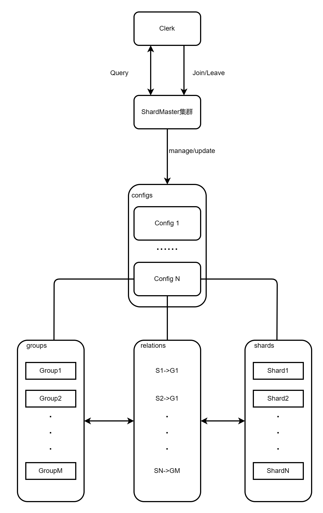
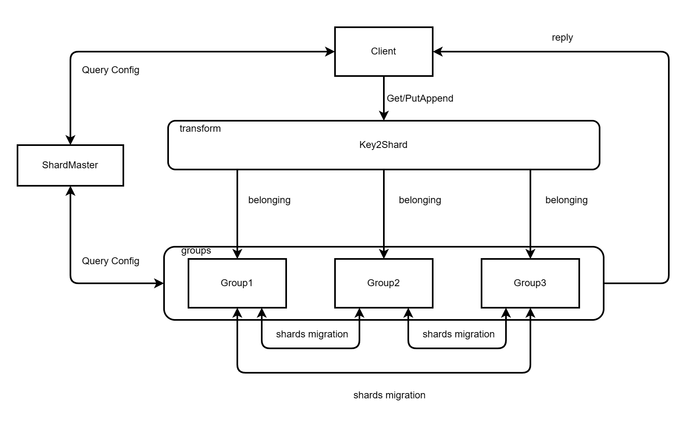
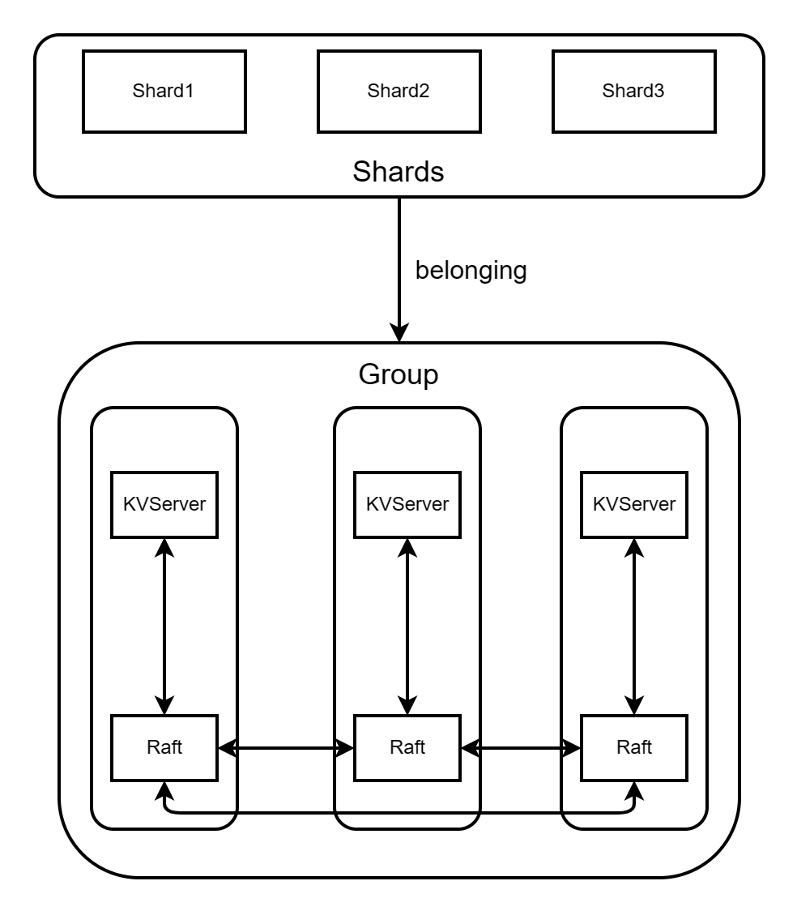
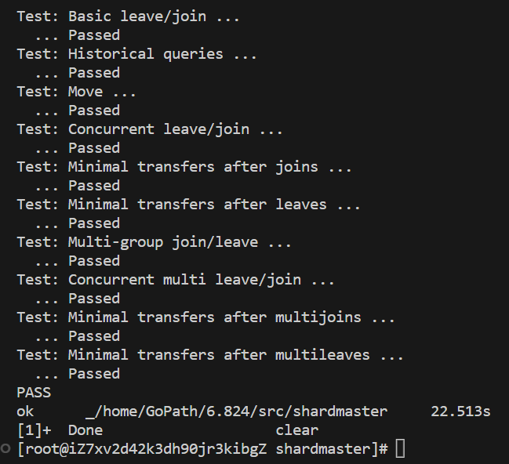
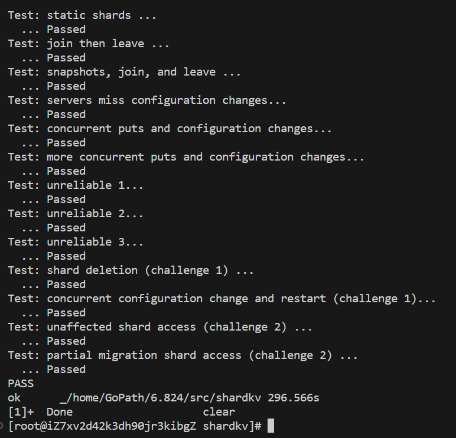

<h1> Sharded Key/Value Service </h1>

<h2>概述</h2>

本次实验将是最难的一次挑战,在lab4中,要求我们在原来KVRaft的基础上实现一个分片式的K/V存储系统,同时需要一个Config/Shard Master来管理这些分片所属,而每个KVServer将按照config来负责自己所属的分片,并支持该分片下的Get/PutAppend操作.

然而,整个过程还包括配置的migration,由于新servers集群的加入或者旧servers集群的离开,Config/Shard Master需要重新分配每个分片所属,并迭代到新的配置.

而对于每个server集群,需不断地拉群新的配置,当需要迭代到新的配置时,有些分片会从集群A迁移至集群B,产生了分片迁移的过程,而如何在配置更新的过程中,能够同时响应Get/PutAppend请求且妥善处理分片迁移的一系列事务,最后达到所有集群的线性化更新,将是本次实验最具难度的地方.

<h2>概念图</h2>

- shardMaster
  


- shardkv



- group



<h2>Lab4a</h2>

<h3>ShardMaster</h3>

shardmaster管理者一个顺序化的配置列表。每个配置都包含着一组group以及对shards的分配信息。每当分配需要修改时(如新的group加入或旧的group离开)，shard master都会创建一个新的配置来管理新的分配信息。同时shard master提供了Query接口供K/V存储系统中的clients和servers查询配置.

整个系统架构和KVRaft是类似的,可以将原本KVRaft中的代码copy过来进行修改,RPC换成了Query,Join,Leave,Move四个,对应着四种Operation,因此本次实验实现的关键在于怎么应用这四种Operation

<h3>负载均衡</h3>

根据Lab指导,我们希望尽可能利用到每个group,且每个group所负责的shards数量尽可能接近,以避免部分group负载过大的问题,因此这里牵扯到了负载均衡的算法,而如何搞定这个算法是整个实验的关键

那么可以简略的思考下,在一个已经负载均衡的情况下,若有新的group加入,或者旧的group离开,都会打破原本的平衡.

- 在Join的情况下,新的group初始分配shard数为0,必须从其他group中拿出一部分给它
- 在Leave的情况下,旧的group原本负责的shards全部都得释放,并将释放的shards分配给其他group

很容易想到的是,每次Join或Leave之后,将shards**随机打乱并平均分配**给每个group,但是这样做有两个问题所在
- 由于shardmaster是一个集群,需要保证其他的副master能进行相同操作后得到**一样的shard分配结果**,很显然随机算法做不到这点
- 根据lab要求,我们要尽可能少地迁移shard,这样在Lab4b中可以减少额外的分片迁移开销,也符合实际的需求,而随机打乱很容易造成不必要的迁移过程

而怎么做才能以上两点呢?首先考虑到第一点,我们可以想到序列化每个group,怎么对group进行序列号,我们再结合第二点,就可以想到排序:**每个group当前所负责的shards数量作为序号,然后进行降序排列**.然而光这点还是不够的,因为当两个group拥有的shards数量相同时还无法保证他们排完之后谁在前谁在后,因此我们还需添加其gid作为判断条件,每个group的gid唯一且大小不同,这样也能保证相同shards数量group之间的序列号.

分片迁移的思路如下:
- 将groupShard降序排列
- 计算得出分片分配的平均值以及多余值,将多余值优先分配给前列group
- 遍历前列group,将其当前分配的shards数量对比所应分配的shards数量(target),若超出则释放超出的部分shards,直到遍历至小于所应分配的shards数量(target)的group
- 在之前遍历前列group的基础上,继续遍历后列group,将其当前分配的shards数量对比所应分配的shards数量(target),若少于则将所释放的shards分配缺少的一部分给对方

为了对原本group进行排序,定义结构体如下:

```go
type groupShard struct {
	gid    int
	shards []int
	size   int
}
```

初始化groupShard数组:

```go
func (sm *ShardMaster) initialGroupShards(newGroup map[int][]string, shards [10]int) []groupShard {
	// 构建gid int ->shards []int 映射
	groupShards := make(map[int][]int, len(newGroup))
	for gid, _ := range newGroup {
		groupShards[gid] = make([]int, 0)
	}

	for i, gid := range shards {
		// 同时要检查是否存在shard对应的group
		_, ok := groupShards[gid]
		if gid != 0 && ok {
			groupShards[gid] = append(groupShards[gid], i)
		}
	}

	// 构建 []groupShard{}数组，便于排序以及重新分配shard
	gsd := make([]groupShard, 0)

	for gid, shards := range groupShards {
		gsd = append(gsd, groupShard{gid: gid, shards: shards, size: len(shards)})
	}

	return gsd
}
```

负载均衡算法:

```go
func (sm *ShardMaster) rebalance(groupShards []groupShard, shards [10]int, additionalShards ...int) [10]int {
	n := len(groupShards)
	if n == 0 {
		return shards
	}

	// 按照size降序排列groupShards(直接插入法)
	for i := 1; i < n; i++ {
		temp := groupShards[i]

		j := i
		for ; j > 0 && (groupShards[j-1].size < temp.size || groupShards[j-1].size == temp.size && temp.gid < groupShards[j-1].gid); j-- {
			groupShards[j] = groupShards[j-1]
		}

		groupShards[j] = temp
	}

	// 平均分配
	avg := 10 / n
	res := 10 % n

	// freeShards存放由超出负载的group释放的shards，pickNum记录当前要分配给负载少的group的shard Index
	freeShards := make([]int, 0, 5)
	pickNum := 0

	// 将addtionalShards并入freeShards中（从删除的group释放出的）
	freeShards = append(freeShards, additionalShards...)

	// 从前面超出负载的group提取出一部分shard放入freeShards中
	i := 0
	for ; i < n; i++ {
		target := avg
		if res > 0 {
			target = avg + 1
			res--
		}

		if groupShards[i].size > target {
			// 超出负载
			freeNum := groupShards[i].size - target
			for j := 0; j < freeNum; j++ {
				shards[groupShards[i].shards[j]] = -1
			}
			// 拿出部分shards
			freeShards = append(freeShards, groupShards[i].shards[:freeNum]...)
			groupShards[i].shards = groupShards[i].shards[freeNum:]
		} else if groupShards[i].size < target {
			if target == avg+1 {
				res++
			}
			break
		}
	}

	// 将释放掉的shards分配给低于负载的group
	for ; i < n; i++ {
		target := avg

		if res > 0 {
			target = avg + 1
			res--
		}
		appendNum := target - groupShards[i].size

		for j := 0; j < appendNum; j++ {
			shardIndex := freeShards[pickNum]
			pickNum++
			shards[shardIndex] = groupShards[i].gid
		}
	}
	return shards
}

```

<h3>其余关键代码</h3>

1.applyJoin

```go
func (sm *ShardMaster) applyJoin(op Op) {
	newServers := op.JoinArgs
	newShards := sm.configs[sm.iteration].Shards
	// 从latest group中获取拷贝
	newGroup := DeepCopyMap(sm.configs[sm.iteration].Groups)

	// 将新的group添加进来
	for gid, servers := range newServers {
		newGroup[gid] = servers
	}
	if len(newGroup) <= 1 {
		// 若仅剩下1个group，则将所有shard分配到该group
		onlyGid := 0
		for gid, _ := range newGroup {
			onlyGid = gid
			break
		}

		for i := 0; i < 10; i++ {
			newShards[i] = onlyGid
		}
	} else {
		// 将未分配的shard等候分配
		additionalShards := []int{}
		for i := 0; i < 10; i++ {
			if newShards[i] == 0 {
				additionalShards = append(additionalShards, i)
			}
		}
		// 构建 []groupShard{}数组，便于排序以及重新分配shard
		gsd := sm.initialGroupShards(newGroup, newShards)

		// 负载均衡获取新的shards
		newShards = sm.rebalance(gsd, newShards, additionalShards...)
	}

	// 添加新的configuration
	sm.iteration++
	sm.configs = append(sm.configs, Config{
		Num:    sm.iteration,
		Shards: newShards,
		Groups: newGroup,
	})
}
```

2.applyLeave

```go
func (sm *ShardMaster) applyLeave(op Op) {
	gids := op.LeaveArgs
	newShards := sm.configs[sm.iteration].Shards
	// 从latest group中获取拷贝
	newGroup := DeepCopyMap(sm.configs[sm.iteration].Groups)

	deleteGroupSet := make(map[int]struct{}, len(gids))
	// 删除group
	for _, gid := range gids {
		delete(newGroup, gid)
		deleteGroupSet[gid] = struct{}{}
	}

	deletedShards := []int{}
	// 将deleteGroup中的shards释放掉
	for i := 0; i < 10; i++ {
		if _, ok := deleteGroupSet[newShards[i]]; ok {
			newShards[i] = 0
			deletedShards = append(deletedShards, i)
		}
	}

	if len(newGroup) <= 1 {
		// 若仅剩下1个group，则将所有shard分配到该group
		onlyGid := 0
		for gid, _ := range newGroup {
			onlyGid = gid
			break
		}

		for i := 0; i < 10; i++ {
			newShards[i] = onlyGid
		}
	} else {
		// 构建 []groupShard{}数组，便于排序以及重新分配shard
		gsd := sm.initialGroupShards(newGroup, newShards)

		// 负载均衡获取新的shards
		newShards = sm.rebalance(gsd, newShards, deletedShards...)
	}

	// 添加新的configuration
	sm.iteration++
	newConfig := Config{
		Num:    sm.iteration,
		Shards: newShards,
		Groups: newGroup,
	}
	DPrintf("%d's newConfig:%v after leave %v\n", sm.me, newConfig, gids)
	sm.configs = append(sm.configs, newConfig)
}
```

3.applyMove

```go
func (sm *ShardMaster) applyMove(op Op) {
	move := op.MoveArgs
	// 从latest group中获取拷贝
	newGroup := DeepCopyMap(sm.configs[sm.iteration].Groups)

	newShards := sm.configs[sm.iteration].Shards

	newShards[move[0]] = move[1]
	// 添加新的configuration
	sm.iteration++
	sm.configs = append(sm.configs, Config{
		Num:    sm.iteration,
		Shards: newShards,
		Groups: newGroup,
	})
}
```

4.applyQuery

```go
func (sm *ShardMaster) applyQuery(op *Op) {
	queryNum := op.QueryArgs

	if queryNum == -1 || queryNum > sm.iteration {
		op.QueryResult = sm.configs[sm.iteration]
	} else {
		op.QueryResult = sm.configs[queryNum]
	}
}
```

<h3>测试结果</h3>



<h2>Lab4b</h2>

<h3>ShardKV</h3>

Lab4b是所有lab中最难的关卡,花了我极大的精力,期间还转换过多次思路,甚至不得不参考网上的思路,最后才得以做出来.

整个lab中,需要在Lab3的基础上,添加分片机制,所有key/Value都将归于shards之中,而每个KVServer需要起一个协程不断地向shardMaster询问新的配置,配置中包含着每个group所应负责的shards信息.当需要迭代到新的config时,每个group需根据新旧配置的变化,得知自己需要负责哪些shards,不需要负责哪些shards,当原本由自己负责的shards不再由自己负责时候,需要进行分片的迁移过程,将不再由自己负责的shard交给其他group,当该group完成分片迁移且接收完其他group迁移而来的分片时,就真正迭代到了下一个config.

<h3>设计思路</h3>

1、首先每个kvserver维护一个shardDB数组，每个shard包含configNum、data、shardId三种信息、还会维护新旧两个config

2、每个kvserver会开启一个协程持续获取当前configNum+1的配置，获取后，得到的配置视为新配置

3、当开启新的配置更新时，group中的leader会让raft开启新的配置更新操作，当新的配置更新操作应用到kvserver时，根据新旧配置的对比，可能会出现如下几种情况
  - 若新加入的shard原来没有group负责，则新创建一个空的shard,其configNum跟进最新的config
  - 若旧配置中的shard在新配置仍然由自己负责，则将其shard跟进最新的config
  - 若新加入的shard原来由其他group负责，且该shard数据还未push过来，则通过该shard的configNum与newConfig对比阻止其读写操作
  - 若新加入的shard原来由其他group负责，且该shard数据提前到来，但是有可能是更低配置下的shard,因此不能进行读写操作,直到等到达到或者超出自己当前配置下configNum的shard到来
  - 若原来自己负责的shard不再由自己负责，则需将该shard的configNun跟进新配置，由其他的协程负责将该shard数据迁移到其他group

4、对于push操作，kvserver会按照新配置中所负责的group对其进行发送MoveShards RPC请求,将分片迁移过去，若回应OK则将立刻开始GC操作.

	PS:配置更新过程中push的终止条件是所有应该迁移出去的shards完成了迁移和GC

5、对于GC操作，kvserver会根据GC状态的shard，调用raft层达成GC共识，一同将该shard数据从shardDB中删除（变为nil）

6、在持续拉取配置的过程中,为了满足实验要求的线性化,尝试拉取新配置前都需要**检查自己是否有资格进入下一个配置**.
	这份资格的检查方式很简单,只需要判断**自己是否有还未迁移出去的shard**,以及**自己是否还有未接收到的shard**,若未满足则等待一段时间重新尝试下一轮拉取阶段

如同lab所言，整个配置更新的过程对于K/V客户端是屏蔽的，客户端可以照常的进行读写操作，配置更新时分片迁移与迁移过程中不受影响的分片读写是可以同时进行的，

	PS:这样的设计无疑是非常优雅且符合实际需求的。

但对照了其他人的实现思路，发现更多人愿意使用pull而不是push的方式来迁移分片数据，push的好处就是一旦push成功就可以直接进行GC操作，而pull的话则需要由其他group告知自己可以gc才能进行GC操作，两个方式的主要区别在于：
- push时分片迁移的主动权在其他group，而GC的主动权在自己
- pull时分片迁移的主动权在自己，而GC的主动权在别的group

<h3>关键代码</h3>

1.结构体定义:

```go
type Op struct {
	// Your definitions here.
	// Field names must start with capital letters,
	// otherwise RPC will break.
	Operaiton string
	Key       string
	Value     string

	Config           shardmaster.Config        // for update config
	Shards           []int                     // for delete shards
	ShardData        map[int]map[string]string // shard->db,for add shard
	ConfigNum        map[int]int               // shard->configNum
	ClientSeqRecords map[int64]int64           // other group's clientsOpRecord

	OpConfigNum int // the configNum when the Op Start in Raft(To avoid the illegal operation after the Configuration changes)

	// unique sign to identify each operation
	ClientId int64
	SerialId int64
}

type Shard struct {
	ConfigNum int               // the config num of a shard
	ShardId   int               // the shard's id
	Data      map[string]string // the data belonging to the shard
}

type ShardKV struct {
	mu           sync.Mutex
	me           int
	rf           *raft.Raft
	applyCh      chan raft.ApplyMsg
	make_end     func(string) *labrpc.ClientEnd
	gid          int
	masters      []*labrpc.ClientEnd
	maxraftstate int // snapshot if log grows this big

	// Your definitions here.
	ck        *shardmaster.Clerk // the client call RPCs to shardMaster
	preConfig shardmaster.Config // the latest config queried from shardmaster
	config    shardmaster.Config // the next config to update

	shardDB []Shard

	clientsOpRecord map[int64]int64 // record each client's max Op sequential number
	waitResultsCh   map[int]chan Op // the waiting Op end channel that matches the logIndex

	LastIncludedIndex int // the raft logs' lastIncludeInded that used to discard old logs
	maxCommandIndex   int // it record the maximum num of CommandIndex

	killed bool
}
```

2.waitApply从applyCh接收msg:

```go
func (kv *ShardKV) waitApply() {
    ......
	for msg := range kv.applyCh {
		// 等待raft节点允许执行apply操作
		if msg.CommandValid {
			kv.mu.Lock()
			if msg.IsSnapShot {
                // read snapshot
                ......
			} else {
				// 记录当前执行的最大commandIndex
				if msg.CommandIndex > kv.maxCommandIndex {
					kv.maxCommandIndex = msg.CommandIndex
				}

				// Get/Put/Append命令
				op := msg.Command.(Op)
				if op.Operaiton == NOF {
					// do nothing
					kv.mu.Unlock()
					continue
				}
				_, isleader := kv.rf.GetState()
				var value string = op.Value
				// 跳过重复执行的kv操作
				if op.SerialId <= kv.clientsOpRecord[op.ClientId] && (op.Operaiton == PutOp || op.Operaiton == AppendOp) {
					kv.mu.Unlock()
					continue
				}
				if op.Operaiton == GetOp || op.Operaiton == PutOp || op.Operaiton == AppendOp {
					if op.OpConfigNum < kv.config.Num && kv.config.Shards[key2shard(op.Key)] != kv.gid {
						// 要执行的kv Op在配置更新之后，且操作的shard不再由自己负责，则不执行
						kv.mu.Unlock()
						continue
					}
				}

				switch {
				case op.Operaiton == GetOp:
					// 执行get操作
					value = kv.shardDB[key2shard(op.Key)].Data[op.Key]
				case op.Operaiton == PutOp:
					// 执行put操作
					kv.shardDB[key2shard(op.Key)].Data[op.Key] = op.Value
				case op.Operaiton == AppendOp:
					// 执行append操作
					if kv.shardDB[key2shard(op.Key)].Data[op.Key] != "" {
						// 值非空则尾添
						kv.shardDB[key2shard(op.Key)].Data[op.Key] += op.Value
					} else {
						// 不存在该键值对则视为put操作
						kv.shardDB[key2shard(op.Key)].Data[op.Key] = op.Value
					}
				case op.Operaiton == UpdateConfigOp:
					// 执行UpdateConfig操作
					kv.applyUpdateConfig(op)
				case op.Operaiton == AddShardOp:
					// 执行UpdateShard操作（只更新最up-to-date的shard数据）
					kv.applyAddShards(op, msg.CommandIndex)
				case op.Operaiton == DeleteShardOp:
					// 执行GC操作
					kv.applyDeleteShards(op)
				}
				if op.Operaiton == PutOp || op.Operaiton == AppendOp {
					// 跟进操作序列（配置更新不做处理）
					if kv.clientsOpRecord[op.ClientId] < op.SerialId {
						kv.clientsOpRecord[op.ClientId] = op.SerialId
					}
				}
				ch, ok := kv.waitResultsCh[msg.CommandIndex]
                ......
				if ok && isleader /*&& !(op.Operaiton == GetOp && !isleader)*/ {
					// 告知该命令执行完毕
					ch <- Op{Operaiton: op.Operaiton, Key: op.Key, Value: value, Shards: op.Shards, ClientId: op.ClientId, SerialId: op.SerialId}
				}

				if isleader && kv.maxraftstate != -1 {
                    // 检查是否要snapshot
                    ......
				}
			}
			kv.mu.Unlock()
		}
	}
}

```

3.K/V RPC修改:

在Get RPC中额外添加如下判断
```go
// 检查当前该分片是否属于当前group负责
shardId := key2shard(args.Key)
if kv.config.Shards[shardId] != kv.gid {
    *reply = GetReply{
        Err: ErrWrongGroup,
    }
    return
}

// 检查该分片数据是否已存在
if kv.shardDB[shardId].Data == nil {
    *reply = GetReply{
        Err: ErrWaiting,
    }
    return
}
```

在PutAppend RPC中额外添加如下判断
```go
shardId := key2shard(args.Key)

if kv.config.Shards[shardId] != kv.gid {
    *reply = PutAppendReply{
        Err: ErrWrongGroup,
    }
    return
}
// PutAppend需要避免重复操作，要加以判断
if args.SerialID <= kv.clientsOpRecord[args.ClientID] {
    // 序列号过期说明是重复的请求
    *reply = PutAppendReply{
        Err: ErrCommandRepeated,
    }
    return
}

// 检查该分片数据是否已存在
if kv.shardDB[shardId].Data == nil {
    *reply = PutAppendReply{
        Err: ErrWaiting,
    }
    return
}
```

4.持续拉取配置信息:

```go
func (kv *ShardKV) keepLastestConfig() {
	for !kv.killed {
		time.Sleep(UpdateConfigPeriod)
		if _, isleader := kv.rf.GetState(); isleader {
			kv.mu.Lock()
			// 获取需要push出去的data
			shardData := kv.getPreparedMoveShardData()
			if len(shardData) > 0 {
				// 存在需要push的数据
				kv.moveShard(shardData)
				DPrintf("kv %d gid:%d cfg:%d resend shard\n", kv.me, kv.gid, kv.config.Num)
				kv.mu.Unlock()
				continue
			}
			// 若未接收完数据并完成所有GC，则继续等待
			if !kv.allReceived() {
				kv.mu.Unlock()
				continue
			}
			// 当上一个UpdateConfig全部阶段完成后，获取下一个要更新的Config
			kv.mu.Unlock()
			newConfig := kv.ck.Query(kv.config.Num + 1)
			kv.mu.Lock()
			//DPrintf("new config %v", preConfig)
			if newConfig.Num == kv.config.Num+1 {
				DPrintf("kv %d gid:%d cfg:%d start next UpdateConfig newConfig:%v\n", kv.me, kv.gid, kv.config.Num, newConfig)
				//DPrintf("kv %d update config to %v\n", kv.me, preConfig)
				op := Op{
					Operaiton: UpdateConfigOp,
					Config:    newConfig,
				}
				kv.rf.Start(op)
				//kv.state = Start
			}
			kv.mu.Unlock()
		}
	}
}
```

5.分片迁移:

MoveShard RPC:
```go
func (kv *ShardKV) MoveShard(args *MoveShardArgs, reply *MoveShardReply) {
	kv.mu.Lock()
	defer kv.mu.Unlock()
	if _, isleader := kv.rf.GetState(); isleader {
		if args.SerialID <= kv.clientsOpRecord[args.ClientID] {
			// 序列号过期说明是重复的请求
			*reply = MoveShardReply{
				Err: ErrCommandRepeated,
			}
			return
		}

		if args.SerialID != int64(kv.config.Num) {
			// the shard arrive in advance
			*reply = MoveShardReply{
				Err: ErrWaiting,
			}
			return
		}

		op := Op{Operaiton: AddShardOp, ShardData: args.Data, ConfigNum: args.ConfigNum, ClientSeqRecords: args.ClientRecords, ClientId: args.ClientID, SerialId: args.SerialID}
		index, _, _ := kv.rf.Start(op)
		if _, ok := kv.waitResultsCh[index]; !ok {
			kv.waitResultsCh[index] = make(chan Op)
		}
		kv.mu.Unlock()
		select {
		case <-time.After(OperaitonTimeOut):
			// 执行超时
			*reply = MoveShardReply{Err: ErrTimeOut}
		case <-kv.waitResultsCh[index]:
			// 执行完成
			*reply = MoveShardReply{
				Err: OK,
			}
		}
		kv.mu.Lock()
		if _, ok := kv.waitResultsCh[index]; ok {
			close(kv.waitResultsCh[index])
			delete(kv.waitResultsCh, index)
		}
	} else {
		// 不是leader
		*reply = MoveShardReply{
			Err: ErrWrongLeader,
		}
	}
}
```

获取需要迁移的shards
```go
func (kv *ShardKV) getPreparedMoveShardData() map[int]Shard {
	data := make(map[int]Shard)

	for shard, gid := range kv.preConfig.Shards {
		if gid == kv.gid && kv.config.Shards[shard] != kv.gid && kv.shardDB[shard].Data != nil {
			data[shard] = kv.shardDB[shard]
		}
	}

	return data
}
```

组装args并发送MoveShard请求
```go
func (kv *ShardKV) callMoveShard(gid int, args MoveShardArgs) {
	if len(args.Data) == 0 {
		return
	}
	// 记录GC所需一并删除的shard
	shards := make([]int, 0, len(args.Data))
	for shard, _ := range args.Data {
		shards = append(shards, shard)
	}
	kv.mu.Lock()
	servers, ok := kv.config.Groups[gid]
	cfgNum := kv.config.Num
	kv.mu.Unlock()
	if ok {
		// try each server for the shard.
		for si := 0; si < len(servers); si++ {
			srv := kv.make_end(servers[si])
			var reply MoveShardReply
			ok := srv.Call("ShardKV.MoveShard", &args, &reply)
			if ok && (reply.Err == OK || reply.Err == ErrNoKey || reply.Err == ErrCommandRepeated) {
				// 成功发送完后，触发GC操作
				kv.mu.Lock()
				needDelete := false
				for _, shardId := range shards {
					if kv.shardDB[shardId].Data != nil /*kv.shardDB[shardId].ConfigNum < kv.config.Num*/ {
						needDelete = true
						break
					}
				}
				op := Op{Operaiton: DeleteShardOp, Shards: shards, ClientId: int64(kv.gid), SerialId: int64(cfgNum)}
				kv.mu.Unlock()
				if needDelete {
					kv.rf.Start(op)
				}
				return
			}
		}
	}
}

// 将分片数据传给对应的group
func (kv *ShardKV) moveShard(shards map[int]Shard) {
	groupShards := make(map[int]map[int]map[string]string)
	configNums := make(map[int]int)
	for shardId, shard := range shards {
		gid := kv.config.Shards[shardId]

		if gid != 0 {
			if _, ok := groupShards[gid]; ok {
				groupShards[gid][shardId] = shard.Data
			} else {
				groupShards[gid] = make(map[int]map[string]string)
				groupShards[gid][shardId] = shard.Data
			}
		}

		configNums[shardId] = shard.ConfigNum
	}
	// 将该group用于检测重复命令的map集合发送到对方group
	clientOpRecords := make(map[int64]int64, len(kv.clientsOpRecord))
	for cid, sid := range kv.clientsOpRecord {
		clientOpRecords[cid] = sid
	}
	for gid, shardsData := range groupShards {
		// 将对应其他group的shards一并push过去
		args := MoveShardArgs{
			Gid:           kv.gid,
			ConfigNum:     configNums,
			Data:          shardsData,
			ClientID:      int64(kv.gid),
			SerialID:      int64(kv.config.Num),
			ClientRecords: clientOpRecords,
		}

		go kv.callMoveShard(gid, args)
	}
}
```

6.判断自己是否接收完其他group迁移的shards:

```go
func (kv *ShardKV) allReceived() bool {
	shardsNotConfig := make([]int, 0)
	for shard, gid := range kv.preConfig.Shards {
		if gid != kv.gid && kv.config.Shards[shard] == kv.gid && kv.shardDB[shard].ConfigNum < kv.config.Num {
			shardsNotConfig = append(shardsNotConfig, shard)
		}
	}
	if len(shardsNotConfig) > 0 {
		return false
	}
	return true
}
```

7.apply函数:

```go
func (kv *ShardKV) applyUpdateConfig(op Op) {
	if op.Config.Num > kv.config.Num {
		newConfig := op.Config
		for shard, gid := range newConfig.Shards {
			if gid == kv.gid {
				// 由自己负责的shard
				if kv.config.Shards[shard] == gid {
					// 原本由自己负责的shard仍然由自己负责
					// 将该shard的配置信息更新，其余不变
					if kv.shardDB[shard].ConfigNum < newConfig.Num {
						kv.shardDB[shard].ConfigNum = newConfig.Num
					}
				} else if kv.config.Shards[shard] == 0 {
					// 新加入的shard在上一个配置信息中不由任何group负责，创建空的shard（由其余group push了则除外）
					if kv.shardDB[shard].Data == nil {
						kv.shardDB[shard] = Shard{
							ConfigNum: newConfig.Num,
							ShardId:   shard,
							Data:      make(map[string]string),
						}
					}
				}
			} else {
				// 新config下,该shard不再由自己负责
				if kv.config.Shards[shard] == kv.gid {
					// 需要将该shard Push出去
					if kv.shardDB[shard].ConfigNum < newConfig.Num {
						// 将该shard的configNum更新
						kv.shardDB[shard].ConfigNum = newConfig.Num
					}
				}
			}
		}
		kv.preConfig = kv.config
		kv.config = newConfig
	}
}

func (kv *ShardKV) applyAddShards(op Op, index int) {
	// 这里需要针对shards操作进行去重
	if op.SerialId <= kv.clientsOpRecord[op.ClientId] {
		DPrintf("kv %d gid:%d cfg:%d add Repeat Shards seqId:%d from %d\n", kv.me, kv.gid, kv.config.Num, op.SerialId, op.ClientId)
		return
	}
	for shardId, data := range op.ShardData {
		// 仅更新更高配置的shard
		if  op.ConfigNum[shardId] > kv.shardDB[shardId].ConfigNum {
			kv.shardDB[shardId] = Shard{
				ConfigNum: op.ConfigNum[shardId],
				Data:      DeepCopyMap(data), 
				ShardId:   shardId,
			}
            ......
		} else {
            ......
		}
	}
	//  跟进对方group的操作序列
	for cid, sid := range op.ClientSeqRecords {
		if kv.clientsOpRecord[cid] < sid {
			kv.clientsOpRecord[cid] = sid
		}
	}

	//  跟进shards操作序列
	kv.clientsOpRecord[op.ClientId] = op.SerialId
}

func (kv *ShardKV) applyDeleteShards(op Op) {
	if op.SerialId < int64(kv.config.Num) {
		return
	}
	for _, shardId := range op.Shards {
		if kv.shardDB[shardId].Data != nil && kv.shardDB[shardId].ConfigNum <= int(op.SerialId) {
			kv.shardDB[shardId].Data = nil
			kv.shardDB[shardId].ConfigNum = int(op.SerialId)
		}
	}
}
```

<h3>踩坑的地方</h3>

- 一开始想过维护两个变量来判断是否可以进入下一个阶段,如kv.allsended,kv.allreceived,然而这样做非常的麻烦,且变量修改的主动权在于其他协程,而该变量仅仅由leader维护,无法同步给其他follower,当再次发生election时自己不再是leader的时候就会出错,因此还是需要在配置更新函数中进行函数判断
  
- 对于applyAddShards操作,同样需要记录其clientOpRecord,来防止执行的重复的Op
  
- 在整个设计过程中,我主要采用了对shard的configNum的检测,来判断是否要push出去或者等待receive,或者应用其他group迁移而来的shards,然而真正实现时,却很容易在这上面放错,如那些需要push出去的shards没有跟进最新的配置,如deleteShards或addShards时,多次修改相关的判断.之所以如此设计,是为了避免低配置的shards覆盖高配置的shards信息

- 引用变量没有去深拷贝,golang中的引用变量如map在拷贝时应该采取深拷贝的方式,而我在addShards操作中因为没有对迁移过来的数据进行深拷贝而花了好几个小时debug才检查出来

- KVServer在配置更新之前,可以一次性向raft提交大量的K/V command,而这之间可能包含着updateConfig的command,在waitApply函数中,当执行完updateConfig操作后,之后的command可能并不属于当前config下的Operation.
  
  具体来说:在config5中,G1负责S1可以接收S1分片下的K/V操作,而当updateConfig后,G1进入config6,该config下G1不再对S1负责,因此我在Op结构体中添加了OpConfigNum表示当前Op所处在config.如此一来,在apply K/V操作之前,还需进行如下判断:
    - 该Op的ConfigNum是否小于当前config
    - 该Op所执行Key所对应的shard是否还归当前config下的group负责
  
  若以上判断均为true,则跳过该Operation,之后会因为超时向client返回ErrTimeOut的error,紧接着client会重新发起request并接收到ErrWrongGroup的error,最后查询新的config,根据该config请求对应的group.

- 测试Unrealiable的时候,不可避免的遇到了raft上的bug,因此还掉头去解决了raft层的bug,一个bug是未给rf.VotedFor加锁,另一个bug是leader存在快照落后的情况

<h3>优化相关</h3>

1.分片迁移方法中,我特定将对于每个group所应发送的shards整合到一起发送,这样可以避免多次发送带来的网络开销,同时GC时也可以一并GC掉多个Shards

2.raft层可能发生活锁,因此需要定期检测log并适当时提交一个空的entry(该entry无实际意义,apply时会跳过),如此也能加快raft层更新lastApplied,而不用等待延迟下的commitIndex更新

3.在发送rpc请求时,无论client还是servers都可以添加一个缓存机制,记录上次发送的leader,未命中则更新(暂时没去实现,在本次lab中感觉提升不大)

<h3>测试结果</h3>



测试的时间看起来比lab参考的时间慢了两倍,实际原因是硬件受限制,所有的lab我都是在2核4g的云服务器上跑的,性能还比不上普通的笔记本

其中,Unrealiable是我最重视的测试,我的大部分bug都是从这检测出来的,在日日夜夜不断debug和修改下,我最终运行了100次无误,其实也可以测上千次的,但我懒得挂在那等了(破CPU跑两个线程就压力拉满了)

<h2>总结</h2>

本次Lab实实在在让我感受到了分布式开发的难度,在一个分布式系统中,如何保证多种操作并行进行且不相互影响,最终达到整个系统线性化更新,其背后涉及的逻辑是严密而复杂的,就比如Lab3b中的快照系统,其相当于在原本系统中再开辟一个子系统进行快照处理,处理这两个系统的交互过程异常的麻烦,涉及的各种逻辑需要长时间的思考和测试才能彻底理清楚.

而在Lab4b中,这一体现更加突出,配置的更新和分片迁移过程需独立于原本的K/V存储服务之外,又会最终影响到K/V存储服务,实现最终的线性化一致性.

完成之后,我明显感受到自己深入理解了分布式系统部分原理,自身的debug能力和并发编程能力也得到很大的提升,也挺感谢mit提供的公开课,能让我循着一定的方向进行学习.

<h2>完结撒花</h2>

终于complish了所有lab!从分布式小白,到如今全部lab通关,真是感慨万千,这其中解决了多少bug,多少次自暴自弃自己都记不清了.我也曾在每个lab开始前一脸懵逼,到最后完成lab后拨云见日,曾经遇到的坎只有过去了才知道一切都值得.